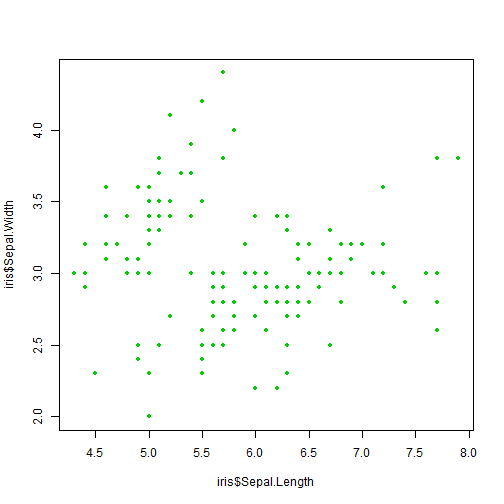

Developing Data Products Project
========================================================
author: Sriram Cheruvu
date: August 7th, 2018
autosize: true

Introduction
========================================================

The key goal of this project is to build and publish a ShinyApp (shinyapp.io) using the IRIS dataset and illustrates how k-based clustering works when the user dynamically selects the following:
 - X variable
 - Y variable
 - Cluster Size:  In addition, the user is provided with the option to select the cluster size (between 1 to 7 clusters). 

The user can slice and analyse the data in a pair wise format and try different options in specifying the number of clusters.

Application Hosting and Instructions
=========================================================
right: 30%

This presentation cab be found at:
<http://rpubs.com/sricheruvu/ShinyAppProject>

The Shiny application created for this project can be found at:
<https://sricheruvu.shinyapps.io/ShinyAppProject/>

The following are the steps the user needs to do to run this application:

1. Identify pairwise clusters in the IRIS dataset by:
     - Selecting X variable.
     - Selecting Y variable.
2. Select number of clusters (between 1 to 7 clusters)

***
<div align="center">


Output - Statistical Data
========================================================
For example if the user selects x variable - Sepal.Length and y variable - Sepal.Width along with cluster size of 3, the following kmeans will be generated:

```
K-means clustering with 3 clusters of sizes 30, 61, 59

Cluster means:
      [,1]
1 7.050000
2 6.047541
3 5.018644

Clustering vector:
  [1] 3 3 3 3 3 3 3 3 3 3 3 3 3 3 2 2 3 3 2 3 3 3 3 3 3 3 3 3 3 3 3 3 3 3 3
 [36] 3 3 3 3 3 3 3 3 3 3 3 3 3 3 3 1 2 1 3 2 2 2 3 1 3 3 2 2 2 2 1 2 2 2 2
 [71] 2 2 2 2 2 1 1 1 2 2 3 3 2 2 3 2 1 2 2 3 3 2 2 3 2 2 2 2 3 2 2 2 1 2 2
[106] 1 3 1 1 1 2 2 1 2 2 2 2 1 1 2 1 2 1 2 1 1 2 2 2 1 1 1 2 2 2 1 2 2 2 1
[141] 1 1 2 1 1 1 2 2 2 2

Within cluster sum of squares by cluster:
[1] 4.635000 5.252131 5.929492
 (between_SS / total_SS =  84.5 %)

Available components:

[1] "cluster"      "centers"      "totss"        "withinss"    
[5] "tot.withinss" "betweenss"    "size"         "iter"        
[9] "ifault"      
```

Output - Plot and Conclusion
========================================================
The corresponding graph is shown below.

***
We used shiny application to demonstrate how flexible the output can be based on the input parameters selected by the user. Clustering using K means have been used to cluster the data from the IRIS dataset based on the inputs selected.
